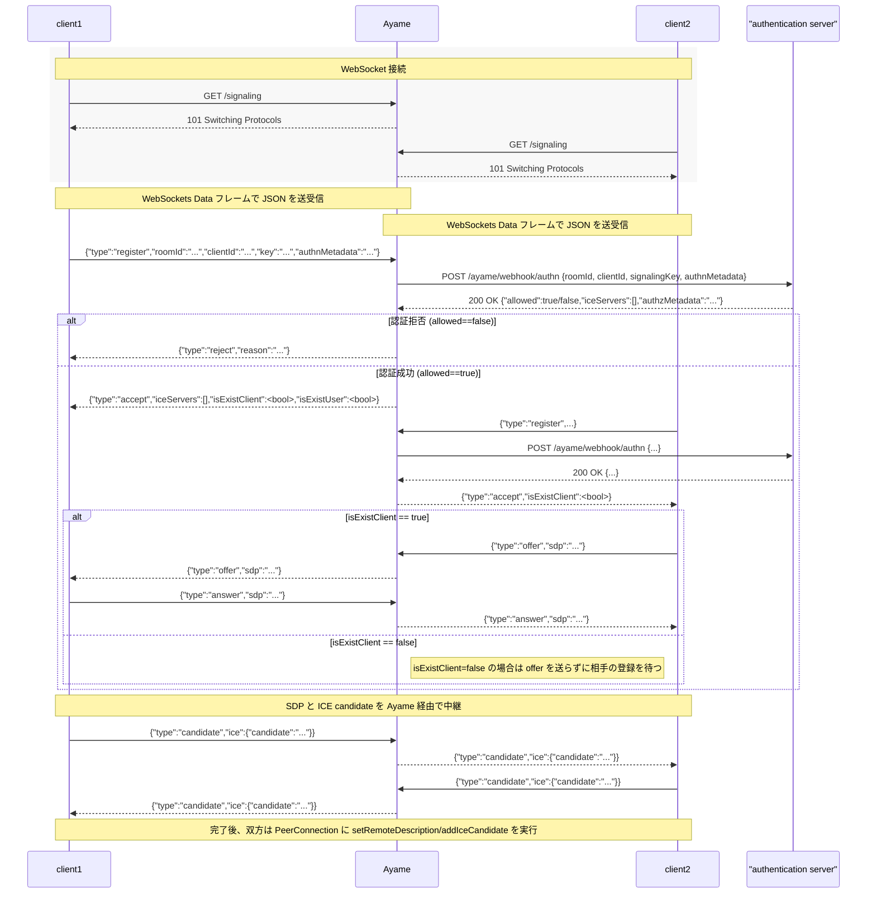

# WebRTC Signaling Server Ayame 仕様

## 概要

これは WebRTC P2P で利用するためのシグナリングサーバ向けの仕様です。
オープンソースとして公開されている https://github.com/OpenAyame/ayame はこの仕様に準拠して実装されています

## 注意

- 開発者向けの仕様書です

## シグナリング

Ayame の `ws://192.0.2.100:3000/signaling` がクライアントからの WebSocket 接続を確立し、管理するエンドポイントとなります。

このエンドポイントに WebSocket で接続すると、Ayame は接続したクライアントの接続を保持します。

このシグナリングサーバは 1 対 1 専用のため、3 つ以上のクライアントの接続要求は拒否します。

Ayame は WebSocket で接続しているクライアントのうちどれかからデータが来ると、
送信元のクライアント以外の接続済みのクライアントにデータを *そのまま* WebSocket で送信します。これらはすべて非同期で行われます。

### 接続確立までのシーケンス図

- Ayame が互いのSDP 交換や peer connection の接続をシグナリングによってやり取りします。
- SDP とは WebRTC の接続に必要な peer connection の 内部情報です。
    - [RFC 4566 \- SDP: Session Description Protocol](https://tools.ietf.org/html/rfc4566)
    - [Annotated Example SDP for WebRTC](https://tools.ietf.org/html/draft-ietf-rtcweb-sdp-11)




### プロトコル

WS のメッセージはJSONフォーマットでやり取りします。
すべてのメッセージはプロパティに `type` を持ちます。
`type` は以下の5つです。

- register
- accept
- reject
- offer
- answer
- candidate
- bye

#### type: register

クライアントが Ayame に対して roomId, clientId を登録するために利用するメッセージです。

```
{type: "register", "roomId" "<string>", "clientId": "<string>"}
```

Ayame は register メッセージを受け取ったら、
そのクライアントが指定した room に入室可能か検査して、可能であれば accept, 不可であれば reject を返却します。

もし認証ウェブフックが有効になっている場合は、まずは認証を行います。

#### type: accept

Ayame が register に込められている情報を検査し、
入室が可能であることをクライアントに知らせるメッセージです。

```
{type: "accept", isExistClient: "<boolean>"}
```

クライアントが accept を受け取った際、 isExistClient が true の場合は offer メッセージを送信します。
isExsistClient が false の場合は answer メッセージを待ちます。

#### type: reject

Ayame が register メッセージで指定した roomId に入室が **不可能** であることをクライアントに知らせるメッセージです。

```
{type: "reject", "reason": "<string>"}
```

これを受け取ったらクライアントは RTCPeerConnection や WebSocket を閉じて初期化する必要があります。

#### type: offer

accept を受け取り isExistClient: true を受け取ったクライアントは offer メッセージを Ayame に送信します。

```
{type: "offer", sdp: "v=0\r\no=- 4765067307885144980..."}
```

これを受け取ったクライアントはこの SDP を remoteDescription をセットします。
また、このタイミングで answer メッセージを生成し、localDescription にセットした後、anwser メッセージ を送信します。

#### type: answer

accept を受け取り isExistClient: false を受け取ったクライアントは offer メッセージを待ち、
offer メッセージを受け取ったら answer メッセージを送信します。

```
{type: "answer", sdp: "v=0\r\no=- 4765067307885144980..."}
```

#### type: candidate

ice candidate を交換するメッセージです。

```
{type: "candidate", ice: {candidate: "...."}}
```

これを受け取ったクライアントは ice candidate を追加します。

#### type: bye

シグナリング用の WebSocket を切断したことを知らせるメッセージです。

```
{type: "bye"}
```

これを受け取ったクライアントは RTCPeerConnection を閉じて、
リモート(受信側)の video element を破棄する必要があります。

### シグナリング詳細

- 積極的に拡張する

- 登録
    - type: register
        - roomId
            - 必須
            - string
        - clientId
            - オプション
                - 要検討
            - string
        - authnMetadata
            - 拡張
            - オプション
            - any
        - signalingKey
            - 拡張
            - オプション
            - string
            - 互換性のため key も許可する
                - 2020.2 で互換性はなくす
            - signalingKey と key 両方飛んできたら signalingKey を優先する
- 切断
    - type: bye
        - 1:1 のどちらかが切断したら飛ばす
- 認証成功
    - 拡張
    - type: accept
        - authzMetadata
            - any
        - iceServers:
            - stun/turn の払い出し
        - isExistClient
            - bool
            - isExistUser も 2020.2 までは飛ばす

- 認証拒否
    - 拡張
    - type: reject
        - reason
            - string
- ピンポン
    - 拡張
    - type: ping
    - type: pong
    - ping を 5 秒間隔でなげて 60 秒 pong が返ってこなかったら切断する

## ウェブフック

- URL の設定は yaml に設定可能にする

### 認証サーバへ飛ばす情報

- clientId
    - 必須
    - string
- roomId
    - 必須
    - string
- authnMetadata
    - オプション
    - any
- signalingKey
    - オプション
    - string
- ayameClient
    - オプション
    - string
- environment
    - オプション
    - string
- libwebrtc
    - オプション
    - string

### 認証サーバから払い出す情報

- allowed
    - 必須
    - boolean
- reason
    - オプション
    - allowed が false のときのみ必須となる
    - string
- authzMetadata
    - オプション
    - クライアントまで届く
    - any
- iceServers:
    - オプション
    - 構成は考える

### シグナリング切断時に飛ばす情報

- roomId
    - 必須
    - string
- clientId
    - 必須
    - string
- reason
    - オプション
    - any


## 設定ファイル

**config.ini**

```ini
debug = true

log_dir = .
log_name = ayame.log

signaling_log_name = signaling.log
webhook_log_name = webhook.log

type_message = false

listen_ipv4_address = 127.0.0.1
listen_port_number = 3000

# authn_webhook_url = http://127.0.0.1:3001/authn_webhook_url
# disconnect_webhook_url = http://127.0.0.1:3001/disconnect_webhook_url
# webhook_request_timeout = 5
```

